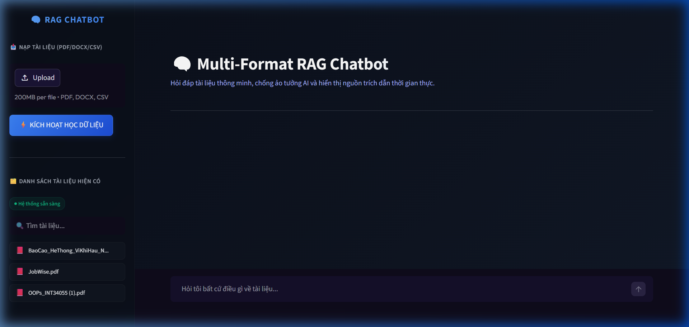
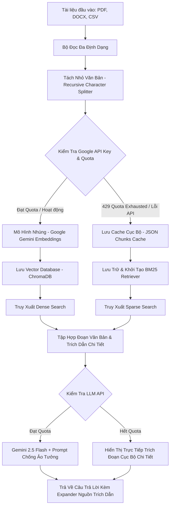

# Multi-Format RAG Chatbot - Hỏi Đáp Tài Liệu Đa Định Dạng

Chào mừng bạn đến với **Multi-Format RAG Chatbot**, giải pháp RAG (Retrieval-Augmented Generation) cho phép nạp, lập chỉ mục và truy vấn tri thức từ nhiều định dạng tài liệu nội bộ (**PDF, DOCX, CSV**) cơ chế chống ảo tưởng nghiêm ngặt và giải pháp dự phòng tìm kiếm thông minh cục bộ.

---

## 📸 Giao Diện Trải Nghiệm Thực Tế



---

## Kiến Trúc Hệ Thống (RAG Architecture)

Hệ thống hoạt động theo quy trình khép kín từ khâu nạp tài liệu cho đến khi trả về câu trả lời có trích dẫn chi tiết:



---

## 🛠️ Công Nghệ Sử Dụng (Tech Stack)

*   **Mắt Xích RAG chính (Framework):** `LangChain` (quản lý kết nối document loaders, splitter, retrievers, và LLM chains).
*   **Mô Hình Ngôn Ngữ Lớn (LLM):** `Google Gemini 2.5 Flash` (Tối ưu hóa chi phí, phản hồi siêu nhanh, độ chính xác cao).
*   **Mô Hình Nhúng (Embeddings):** `Google Gemini Embeddings` (models/gemini-embedding-2 hoặc models/text-embedding-004).
*   **Cơ Sở Dữ Liệu Vector (VectorDB):** `ChromaDB` (Lưu trữ và truy vấn tương đồng ngữ nghĩa nhanh chóng).
*   **Giải Pháp Dự Phòng 100% Cục Bộ (Fail-safe Fallback):** `BM25 (rank_bm25)` - tự động kích hoạt khi Google API Key hết hạn (429 Resource Exhausted) giúp hệ thống hoạt động ổn định mọi lúc, mọi nơi.
*   **Bộ Đọc Định Dạng (Document Loaders):** `PyPDF` (đọc PDF), `python-docx` (đọc Word), và `Pandas` (đọc cấu trúc dòng CSV kèm siêu dữ liệu).
*   **Giao Diện Web (Web UI):** `Streamlit` tùy biến sâu bằng CSS Custom mang lại phong cách Glassmorphism đỉnh cao.

---

## Các Tính Năng Vượt Trội (Key Features)

1.  **Xử Lý Đa Định Dạng Trực Quan:** Tự động chuẩn hóa siêu dữ liệu (metadata) theo từng loại file:
    *   **PDF:** Trích dẫn chính xác đến từng **Trang**.
    *   **Word (DOCX):** Trích dẫn chính xác theo **Phần** (Chunk).
    *   **CSV:** Chuyển đổi dữ liệu dòng thành văn bản ngữ nghĩa và trích dẫn chính xác theo **Dòng (Row)**.
2.  **Prompt Engineering Chống Ảo Tưởng Nghiêm Ngặt:** Sử dụng Prompt cấu hình hệ thống tối tân, ép LLM bắt buộc phải trả lời dựa trên tài liệu cung cấp. Nếu thông tin không có, LLM sẽ trả lời *"Tôi không biết"* thay vì sáng tạo thông tin sai lệch.
3.  **Cơ Chế Fail-safe Độc Quyền (Automatic Fallback):**
    *   Nếu mô hình `text-embedding-004` không khả dụng tại quốc gia của bạn, hệ thống tự chuyển sang `gemini-embedding-2`.
    *   Nếu Google API bị lỗi 429 (Resource Exhausted - Hết lượt gọi miễn phí), hệ thống tự động chuyển sang cơ chế tìm kiếm **BM25 Cục Bộ** hoạt động 100% offline, lưu cache vào `data/chunks_cache.json` và phản hồi thông tin trích đoạn chuẩn xác.
4.  **Tự Động Học Dữ Liệu Trực Tiếp:** Chỉ cần kéo thả file mới vào Web UI và click nút bấm, hệ thống sẽ thực hiện quy trình nạp, băm và ghi nhớ tài liệu chỉ trong vài giây.

---

## 🚀 Hướng Dẫn Cài Đặt & Chạy Thử Chi Tiết Từ A-Z

### 1. Chuẩn bị Môi Trường
Đảm bảo bạn đã cài đặt Python (từ phiên bản 3.9 đến 3.12). 

Mở terminal và thực hiện:
```bash
# Clone dự án (nếu tải từ github) hoặc truy cập thư mục dự án
cd rag-pdf-chatbot

# Tạo môi trường ảo venv
python -m venv venv

# Kích hoạt môi trường ảo
# Trên Windows (PowerShell):
.\venv\Scripts\Activate.ps1
# Trên Windows (CMD):
.\venv\Scripts\activate.bat
# Trên macOS/Linux:
source venv/bin/activate

# Cài đặt các thư viện cần thiết
pip install -r requirements.txt
```

### 2. Cấu hình Khóa API (API Key)
1. Truy cập [Google AI Studio](https://aistudio.google.com/) để lấy Google API Key hoàn toàn miễn phí.
2. Tạo tệp `.env` tại thư mục gốc của dự án với nội dung:
```env
GOOGLE_API_KEY=your_gemini_api_key_here
```

### 3. Tạo Dữ Liệu Mẫu (Tùy chọn)
Nếu bạn chưa có tài liệu trong thư mục `data/`, bạn có thể chạy script để hệ thống tự tạo ra 3 file mẫu chuẩn chỉnh (PDF trắc nghiệm, DOCX nội quy và CSV báo cáo doanh số):
```bash
python generate_samples.py
```

### 4. Khởi Chạy Pipeline Nạp Dữ Liệu (Indexing)
Chạy script indexing để hệ thống bắt đầu học tài liệu từ thư mục `data/` và tạo cơ sở dữ liệu Vector DB cục bộ:
```bash
python 01_indexing.py
```
*Sau khi hoàn tất, script sẽ yêu cầu bạn nhập thử 1 câu hỏi trên Terminal để kiểm tra độ nhạy tìm kiếm.*

### 5. Chạy Thử Giao Diện Web UI (Streamlit)
Bật giao diện hỏi đáp tương tác trực quan cao cấp bằng lệnh:
```bash
streamlit run app.py
```
Trình duyệt sẽ tự động mở trang web RAG tại địa chỉ: `http://localhost:8501`.
